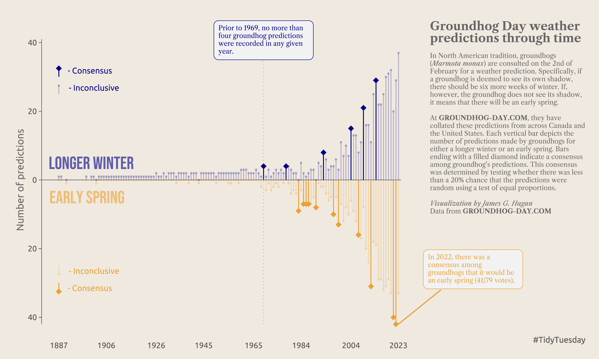
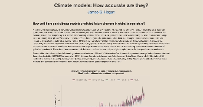
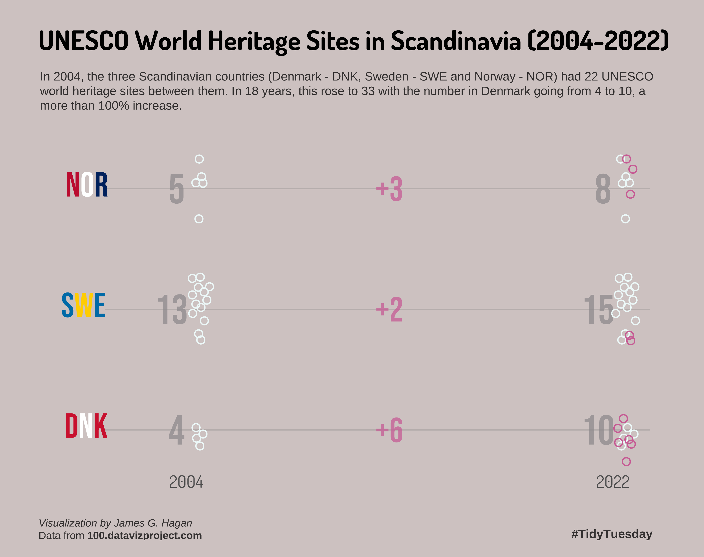
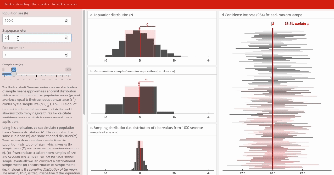

<h1 style="font-weight:normal" align="center">
  &nbsp;Data Visualisation (DataViz) projects&nbsp;
</h1>

 

&nbsp;&nbsp;&nbsp;

 

A collection of data visualisation projects that I have enjoyed doing recently. These include contributions to the [#TidyTuesday challenge](https://github.com/rfordatascience/tidytuesday) along with other data visualisation projects that I was interested in. All visualisations were done using 100% R-code, mostly using `{ggplot2}`, `{tidyr}` and `{dplyr}` but also other amazing packages in the R and tidyverse ecosystem.
 
 

### 1. TidyTuesday: Week 5 (2024-01-30)

 

### 2. Combined Heating and Power (CHP) fuel in the EU

 

### 3. How accurate are climate models?

 

### 4. TidyTuesday: Week 6 (2024-02-06)

 

### 5. Exploring the Central Limit Theorem

This is a ShinyApp used to explore the Central Limit Theorem. I recently wrapped some R-code that I used as a teaching tool during some of the biostatistics courses that I taught into a ShinyApp.

 

 

